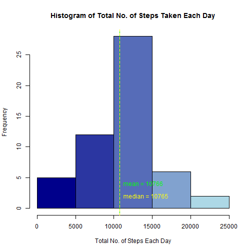
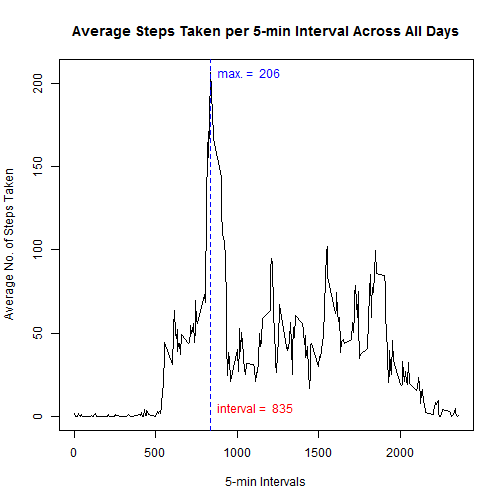
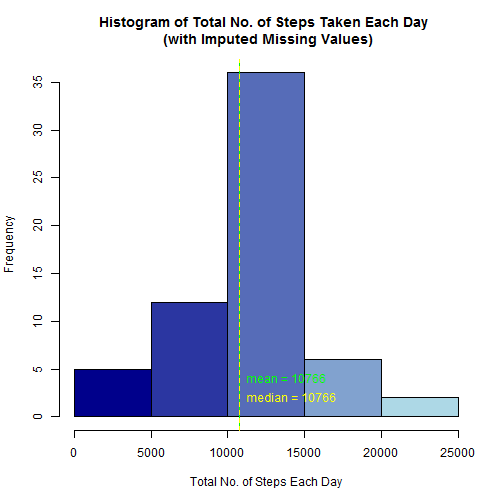
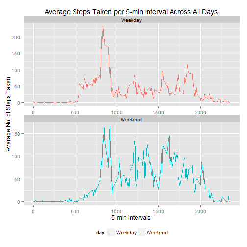

## Reproducible Research: Peer Assessment 1

Authored By: Eric Lim B G, Authored Date: 15-Oct-14  
GitHub Repo @ https://github.com/EricLimBG/RepData_PeerAssessment1

------------------------------------------------------------------------------

#### Introduction

It is now possible to collect a large amount of data about personal movement using activity monitoring devices such as a Fitbit, Nike Fuelband, or Jawbone Up. This assignment makes use of [activity data](http://d396qusza40orc.cloudfront.net/repdata%2Fdata%2Factivity.zip) collected from such devices from an anonymous individual across 2 months at intervals of 5 minute through out each day. The data consists of a total of 17,568 observations that includes the following variables:

- **steps:** *Number of steps taking in a 5-minute interval (missing values are coded as NA)*
- **date:** *The date on which the measurement was taken in YYYY-MM-DD format*
- **interval:** *Identifier for the 5-minute interval in which measurement was taken*

This assigment performs exploratory data analysis on the activity data so as to address assigment questions (below) and makes use of literate statistical programming to ensure reproducibility of the research.

------------------------------------------------------------------------------

#### Loading and preprocessing the data
Show any code that is needed to

1. Load the data (i.e. read.csv())

2. Process/transform the data (if necessary) into a format suitable for your analysis

```r
unzip("activity.zip")
actdata <- read.csv("activity.csv")
tail(actdata) # preview data format & verify no. of observations
```

```
##       steps       date interval
## 17563    NA 2012-11-30     2330
## 17564    NA 2012-11-30     2335
## 17565    NA 2012-11-30     2340
## 17566    NA 2012-11-30     2345
## 17567    NA 2012-11-30     2350
## 17568    NA 2012-11-30     2355
```

*The data format and number of observations are correct.*

------------------------------------------------------------------------------

#### What is mean total number of steps taken per day?
For this part of the assignment, you can ignore the missing values in the dataset.

1. Make a histogram of the total number of steps taken each day

2. Calculate and report the mean and median total number of steps taken per day

```r
library(graphics)
pal <- colorRampPalette(c("darkblue","lightblue"))
totaldata <- aggregate(steps~date,actdata,sum,na.rm=TRUE)

with(totaldata,{
    vmean <- round(mean(steps)) ; vmedian <- round(median(steps))
    hist(steps,col=pal(5),
         main="Histogram of Total No. of Steps Taken Each Day",
         xlab="Total No. of Steps Each Day")
    abline(v=vmean,lty=1,col="green")
    text(vmean,4,labels=paste0("mean = ",vmean),pos=4,col="green")                    
    abline(v=vmedian,lty=2,col="yellow")
    text(vmedian,2,labels=paste0("median = ",vmedian),pos=4,col="yellow")    
    }
)
```

 

*The mean and median total number of steps taken per day are **10766** and **10765** respectively.*

------------------------------------------------------------------------------

#### What is the average daily activity pattern?
1. Make a time series plot (i.e. type = "l") of the 5-minute interval (x-axis) and the average number of steps taken, averaged across all days (y-axis)

2. Which 5-minute interval, on average across all the days in the dataset, contains the maximum number of steps?

```r
avgdata <- aggregate(steps~interval,actdata,mean)
with(avgdata,{
    vmax <- round(avgdata[which.max(steps),]$steps)
    vint <- avgdata[which.max(steps),]$interval
    plot(interval,steps,type='l',col=1,
         main="Average Steps Taken per 5-min Interval Across All Days",
         xlab="5-min Intervals",ylab="Average No. of Steps Taken")
    abline(v=vint,lty=2,col="blue")
    text(vint,vmax,labels=paste("max. = ",vmax),pos=4,col="blue") 
    text(vint,5,labels=paste("interval = ",vint),pos=4,col="red") 
    }
)
```

 

*The 5-minute interval at **835**, on average across all days contains the maximum number of steps of **206**.*

------------------------------------------------------------------------------

#### Imputing missing values
Note that there are a number of days/intervals where there are missing values (coded as NA). The presence of missing days may introduce bias into some calculations or summaries of the data. The following part

1. Calculate and report the total number of missing values in the dataset (i.e. the total number of rows with NAs);

```r
sum(is.na(actdata))
```

```
## [1] 2304
```

*The total number of missing values (i.e. NA) in the dataset is **2304**.*

2. Devise a strategy for filling in all of the missing values in the dataset. The strategy does not need to be sophisticated. For example, you could use the mean/median for that day, or the mean for that 5-minute interval, etc.  

*My strategy is to impute missing values with the mean for that 5-minute interval.*

3. Create a new dataset that is equal to the original dataset but with the missing data filled in.

```r
inputedata <- actdata
for (i in 1:nrow(inputedata)){
    if (is.na(inputedata$steps[i])){
        row_id <- which(avgdata$interval==inputedata$interval[i])
        inputedata$steps[i] <- avgdata$steps[row_id]
    }
}
```

*The code duplicates the inputed dataset from the activity dataset, searches it for missing steps, and replaces them with their mean 5-min interval from the average dataset.*

4. Make a histogram of the total number of steps taken each day and Calculate and report the mean and median total number of steps taken per day. Do these values differ from the estimates from the first part of the assignment? What is the impact of imputing missing data on the estimates of the total daily number of steps?

```r
totaldata2 <- aggregate(steps~date,inputedata,sum)

with(totaldata2,{
    vmean <- round(mean(steps)) ; vmedian <- round(median(steps))
    hist(steps,col=pal(5),
         main="Histogram of Total No. of Steps Taken Each Day \n (with Imputed Missing Values)",
         xlab="Total No. of Steps Each Day")
    abline(v=vmean,lty=1,col="green")
    text(vmean,4,labels=paste0("mean = ",vmean),pos=4,col="green")                    
    abline(v=vmedian,lty=2,col="yellow")
    text(vmedian,2,labels=paste0("median = ",vmedian),pos=4,col="yellow")    
    }
)
```

 

*After imputing missing values from the dataset, the mean and median total number of steps taken per day are both **10766**. Changes are observed in the median value while the mean value remains unchanged from the first part of the assignment.*

------------------------------------------------------------------------------

#### Are there differences in activity patterns between weekdays and weekends?
For this part the weekdays() function may be of some help here. Use the dataset with the filled-in missing values for this part.

1. Create a new factor variable in the dataset with two levels - "weekday" and "weekend" indicating whether a given date is a weekday or weekend day.

2. Make a panel plot containing a time series plot (i.e. type = "l") of the 5-minute interval (x-axis) and the average number of steps taken, averaged across all weekday days or weekend days (y-axis). The plot should look something like the following, which was creating using simulated data.

3. Your plot will look different from the one above because you will be using the activity monitor data. Note that the above plot was made using the lattice system but you can make the same version of the plot using any plotting system you choose.

```r
library(ggplot2)
inputedata$day <- factor(weekdays(as.Date(inputedata$date)))
levels(inputedata$day) <- list(Weekday = c("Monday","Tuesday","Wednesday","Thursday","Friday"),
                               Weekend = c("Saturday", "Sunday"))
avgdata2 <- aggregate(steps~interval+day,inputedata,mean)

ggplot(avgdata2, aes(interval,steps,fill=day)) + geom_line(aes(colour=day)) + 
xlab("5-min Intervals") + ylab("Average No. of Steps Taken") + 
facet_wrap(~day,nrow=2,ncol=1,scale="free") + theme(legend.position="bottom") + 
ggtitle("Average Steps Taken per 5-min Interval Across All Days")
```

 

------------------------------------------------------------------------------
